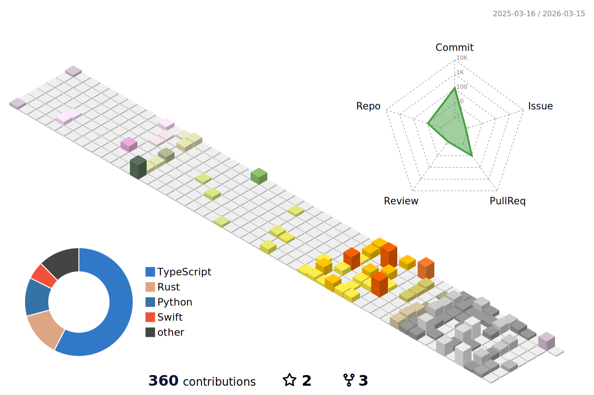

## My GitHub Stats

  <picture>
    <source media="(prefers-color-scheme: dark)" srcset="output/metrics.base.svg" />
    <source media="(prefers-color-scheme: light)" srcset="output/metrics.base.svg" />
    
  </picture>
  <picture>
    <source media="(prefers-color-scheme: dark)" srcset="output/details.svg" />
    <source media="(prefers-color-scheme: light)" srcset="output/details.svg" />
    
  </picture>

  <picture>
    <source media="(prefers-color-scheme: dark)" srcset="profile-3d-contrib/profile-night-rainbow.svg" />
    <source media="(prefers-color-scheme: light)" srcset="profile-3d-contrib/profile-season-animate.svg" />
    
  </picture>

  <picture>
    <source media="(prefers-color-scheme: light)" srcset="output/metrics.plugin.achievements.compact.svg" />
    <source media="(prefers-color-scheme: dark)" srcset="output/metrics.plugin.achievements.compact.svg" />
    
  </picture>

