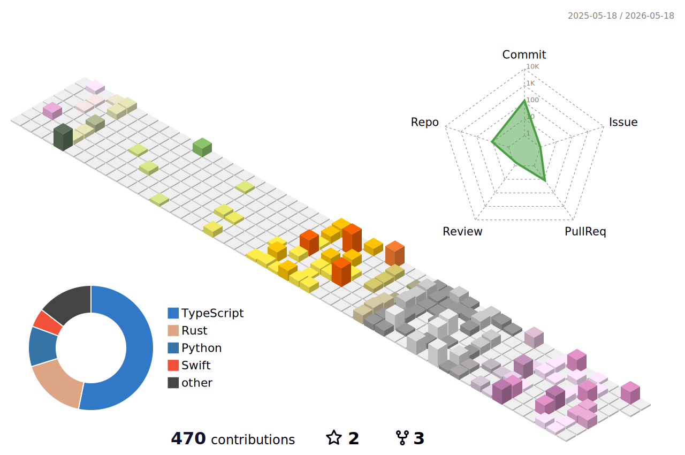

#  Hi, I'm Subaru Kataoka

> デジタルから現実へ実装する  
> Designing new perception & experiences through HCI, AI, and XR

---

## About Me
- 高校2年
- 領域: **HCI,AI,XR,Security**

---

##  Achievements

###  Programs
- **SecHack365（表現駆動コース）** 優秀修了 
  *2025.05 – 2026.03 / NICT*
- **GCI 2024 Winter（東大松尾研）** 修了  
  *データサイエンス × マーケティング*
- **深層生成モデル2025（同）** 修了
- **大規模言語モデル応用2026（同）** 修了
- **セキュリティ・ミニキャンプ2025 大阪** 参加
- **情報科学の達人 7期生(2026)** 採択

###  Competitions
- **異能vation　ジェネレーションアワード2025 ノミネート** 
- **言語学オリンピック2025 全国大会 努力賞**
- **算数オリンピック キッズBEE ２位（2018）**

---

##  Projects

###  Hito-Fude
> イラスト制作過程の真正性を証明するシステム

- ログの改ざん耐性（ハッシュチェーン）
- TEE内での署名による真正性保証
- 生成物とのピクセル整合性検証

**Key Idea:**  
「創作の過程」を証明対象にすることで、AI時代の信頼を再構築する

SecHack365内で共同開発、優秀認定

---

##  Interests

- HCI / XR / 空間コンピューティング
- AIによる知覚・デザイン
- Product Security / Trust 

---

##  Links

- X: https://x.com/Nox108145

---

  <picture>
    <source media="(prefers-color-scheme: dark)" srcset="output/metrics.base.svg" />
    <source media="(prefers-color-scheme: light)" srcset="output/metrics.base.svg" />
    
  </picture>
  <picture>
    <source media="(prefers-color-scheme: dark)" srcset="output/details.svg" />
    <source media="(prefers-color-scheme: light)" srcset="output/details.svg" />
    
  </picture>

  <picture>
    <source media="(prefers-color-scheme: dark)" srcset="profile-3d-contrib/profile-night-rainbow.svg" />
    <source media="(prefers-color-scheme: light)" srcset="profile-3d-contrib/profile-season-animate.svg" />
    
  </picture>

  <picture>
    <source media="(prefers-color-scheme: light)" srcset="output/metrics.plugin.achievements.compact.svg" />
    <source media="(prefers-color-scheme: dark)" srcset="output/metrics.plugin.achievements.compact.svg" />
    
  </picture>

